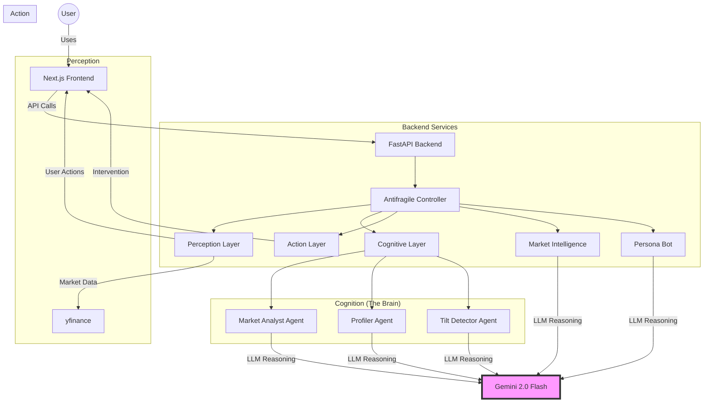

# 🧠 Trading Analyst - AI-Powered Trading Psychology System

[](https://www.python.org/downloads/)
[](https://nextjs.org/)
[](https://fastapi.tiangolo.com/)
[](https://opensource.org/licenses/MIT)

> **A Next-Generation Behavioral Trading System combining Real-Time Psychology Monitoring, Market Intelligence, and AI-Generated Social Content**

## Unlike traditional trading bots that focus solely on price action, Trading Analyst monitors the **delta between market state and trader mental state** to prevent emotional trading decisions while providing deep market analysis and content generation capabilities.

## ✨ Key Features

### 🎯 Behavioral Psychology Engine

- **Real-Time Tilt Detection**: Multi-agent AI system detects emotional trading patterns
- **Automated Interventions**: Graduated responses from soft nudges to trading lockouts
- **Trader Profiling**: Identifies 5 psychological bias types from trade history

### 📊 Market Intelligence Layer

- **"Why It Moved" Analysis**: LLM-powered market movement explanations
- **Technical Indicators**: RSI, SMA, trend analysis, support/resistance
- **News Integration**: Real-time headlines correlated with price action
- **Daily Briefings**: Multi-ticker market summaries

### 🎭 Social Content Studio

- **AI Personas**: Generate content in 4+ analyst personalities
- **Multi-Platform**: Twitter threads, LinkedIn posts, newsletters
- **Market-Aware**: Content adapts to current market conditions
- **LinkedIn Integration**: Direct posting capabilities (OAuth)

---

## 🚀 Quick Start

### Prerequisites

- Python 3.11+
- Node.js 18+
- Gemini API key ([Get one free](https://aistudio.google.com))

### Installation

#### 1. Clone the Repository

```bash
git clone https://github.com/yourusername/trading-analyst.git
cd trading-analyst
```

#### 2. Backend Setup

```bash
# Install Python dependencies
pip install -r requirements.txt
# Create .env file
echo GEMINI_API_KEY=your_api_key_here > .env
```

#### 3. Frontend Setup

```bash
cd frontend
npm install
cd ..
```

#### 4. Run the Application

**Option A: Using Batch Scripts (Windows)**

```bash
# Terminal 1 - Backend
run_backend.bat
# Terminal 2 - Frontend
run_frontend.bat
```

**Option B: Manual**

```bash
# Terminal 1 - Backend
cd api
uvicorn main:app --reload --port 8001
# Terminal 2 - Frontend
cd frontend
npm run dev
```

#### 5. Access the Application

- **Frontend**: http://localhost:3000
- **API Docs**: http://localhost:8001/docs

---

## 📁 Project Structure

```
trading-analyst/
├── api/                          # FastAPI backend
│   └── main.py                  # API endpoints
├── frontend/                     # Next.js frontend
│   ├── src/
│   │   ├── app/                 # App router pages
│   │   │   ├── page.tsx        # Dashboard
│   │   │   ├── coach/          # Behavioral coach
│   │   │   ├── analyst/        # Market intelligence
│   │   │   └── studio/         # Social content studio
│   │   ├── components/         # React components
│   │   └── lib/                # Utils and API client
│   └── package.json
├── perception_layer.py          # Market & user behavior sensing
├── cognitive_layer.py           # Multi-agent reasoning (3 AI agents)
├── action_layer.py              # Intervention generation
├── market_intelligence.py       # Market analysis & news
├── persona_bot.py              # Social content generation
├── antifragile_controller.py   # Main orchestration
├── config.py                   # System configuration
├── data_manager.py             # Mock trade data
└── requirements.txt            # Python dependencies
```

---

## 🏗️ Architecture

### System Overview



### The 3 AI Agents (Cognitive Layer)

1. **Market Analyst Agent**
   - Detects regime shifts (LOW_VOL → HIGH_VOL → CRISIS)
   - Analyzes volatility and volume anomalies
   - Provides risk level assessments using **Gemini 2.0 Flash** reasoning capabilities.
2. **Profiler Agent**
   - Analyzes trading history to identify biases
   - Detects patterns: Loss Aversion, FOMO, Revenge Trading
   - Builds trader psychological profile
3. **Tilt Detector Agent**
   - Cross-references market state + user behavior + trader profile
   - Calculates tilt score (0-10)
   - Triggers interventions when needed using nuanced LLM analysis

---

## 🎭 Features Deep Dive

### Behavioral Coach

**Tilt Detection Algorithm:**

```python
Tilt Score = f(Market Volatility, User Velocity, Historical Patterns)
Score 0-4:  No intervention
Score 5-6:  SOFT_NUDGE (💡 Behavioral Notice)
Score 7-8:  CRITICAL (⚠️ Tilt Warning)
Score 9-10: HARD_LOCK (🚨 Trading Suspended 5min)
```

**Example Scenario:**

```
USER ACTION: 5 order cancels in 2 minutes after $500 loss
SYSTEM DETECTION:
├─ Perception: High interaction velocity detected
├─ Cognitive: Revenge pattern + HIGH_VOL market
└─ Action: HARD_LOCK intervention
OUTPUT: "You are attempting to 'win back' a loss.
This is a cognitive error, not a trading signal.
Trading suspended for 5 minutes."
```

### Market Intelligence

**"Why It Moved" Analysis:**

- Fetches real-time news from yfinance
- Calculates technical indicators (RSI, SMA, support/resistance)
- Uses LLM to synthesize price + news + technicals into narrative
- Provides actionable insights and key levels
  **Daily Briefing:**
- Multi-ticker market overview
- Highlights significant movers
- Identifies key patterns and risks

### Social Content Studio

**AI Personas:**

- 📊 **The Data Hawk**: Technical, data-driven
- 🎭 **The Contrarian**: Skeptical, risk-focused
- 🚀 **The Moon Boy**: Enthusiastic, opportunity-focused
- 🧘 **The Zen Trader**: Calm, discipline-oriented
  **Content Types:**
- Twitter posts (280 char)
- Twitter threads (multi-tweet analysis)
- LinkedIn posts (professional tone)
- Daily briefing newsletters

---

## 🛠️ Technology Stack

### Frontend

| Technology        | Purpose                         |
| ----------------- | ------------------------------- |
| **Next.js 15**    | React framework with App Router |
| **React 19**      | UI library                      |
| **TypeScript**    | Type safety                     |
| **Tailwind CSS**  | Styling                         |
| **Framer Motion** | Animations                      |
| **Lucide Icons**  | Icon system                     |

### Backend

| Technology       | Purpose                     |
| ---------------- | --------------------------- |
| **FastAPI**      | Modern Python API framework |
| **Uvicorn**      | ASGI server                 |
| **Pydantic**     | Data validation             |
| **Python 3.11+** | Core language               |

### AI & Data

| Technology               | Purpose              |
| ------------------------ | -------------------- |
| **Gemini 2.0 Flash**     | LLM reasoning engine |
| **yfinance**             | Market data & news   |
| **pandas/numpy**         | Data processing      |
| **Google AI Python SDK** | Gemini API client    |

---

## 📊 API Endpoints

### Core Endpoints

```
GET  /api/health              - Health check
POST /api/trades/load-demo    - Load demo trades
GET  /api/trades              - Get all trades
GET  /api/trades/metrics      - Get trade metrics
POST /api/system/initialize   - Initialize trader profile
GET  /api/system/status       - System status
GET  /api/system/diagnostics  - Full diagnostics
POST /api/behavioral/analyze  - Run behavioral analysis
GET  /api/trader-profile      - Get trader profile
```

### Market Intelligence

```
POST /api/market/analyze       - Market movement analysis
GET  /api/market/technicals/:ticker  - Technical indicators
GET  /api/market/news/:ticker        - Recent news
POST /api/briefing/generate          - Daily briefing
```

### Social Content

```
GET  /api/personas             - List available personas
POST /api/social/generate      - Generate social content
```

---

## ⚙️ Configuration

Edit `config.py` to customize:

```python
# LLM Model
PRIMARY_MODEL = "gemini-2.0-flash"
# Thresholds
VOLATILITY_THRESHOLD = 0.02      # 2% for regime detection
TILT_THRESHOLDS = {
    'SOFT_NUDGE': 5,
    'CRITICAL': 7,
    'HARD_LOCK': 9
}
# Intervention Settings
HARD_LOCK_DURATION = 5          # minutes
MAX_INTERVENTIONS_PER_HOUR = 10
```

---

## 🧪 Testing

```bash
# Run backend tests
python test_antifragile.py
python test_intervention.py
python examples.py
# Frontend development
cd frontend
npm run dev
# Build for production
npm run build
npm start
```

---

## 🎯 Use Cases

### Individual Traders

- Prevent revenge trading patterns
- Detect FOMO entries during market pumps
- Build awareness of personal biases
- Generate content for trading journal

### Trading Firms

- Monitor team psychology at scale
- Implement automated risk controls
- Generate market commentary for clients
- Track behavioral patterns across traders

### Content Creators

- Generate market analysis content
- Maintain consistent posting schedule
- Adapt content to market conditions
- Multi-platform content distribution

---

## 🔮 Roadmap

### Completed ✅

- [x] Multi-agent behavioral system
- [x] Next.js modern frontend
- [x] Market intelligence layer
- [x] Social content generation
- [x] LinkedIn OAuth integration

### In Progress 🚧

- [ ] Real-time WebSocket updates
- [ ] Advanced chart visualizations
- [ ] Mobile responsive design enhancements

### Planned 📋

- [ ] Pinecone vector DB for long-term memory
- [ ] Apple Watch biometric integration
- [ ] Interactive Brokers API
- [ ] Discord/Telegram bot integration
- [ ] Custom AI persona training

---

## 📝 Environment Variables

Create a `.env` file in the root directory:

```bash
# Required
GEMINI_API_KEY=your_gemini_api_key
# Optional - LinkedIn Integration
LINKEDIN_CLIENT_ID=your_client_id
LINKEDIN_CLIENT_SECRET=your_client_secret
LINKEDIN_REDIRECT_URI=http://localhost:8501
```

---

## 🤝 Contributing

Contributions are welcome! Please:

1. Fork the repository
2. Create a feature branch (`git checkout -b feature/amazing-feature`)
3. Commit your changes (`git commit -m 'Add amazing feature'`)
4. Push to the branch (`git push origin feature/amazing-feature`)
5. Open a Pull Request

---

## 📄 License

## This project is licensed under the MIT License - see the [LICENSE](LICENSE) file for details.

## 🙏 Acknowledgments

Built with:

- [Gemini AI](https://ai.google.dev/) - LLM reasoning engine
- [Next.js](https://nextjs.org) - React framework
- [FastAPI](https://fastapi.tiangolo.com/) - Modern Python API
- [yfinance](https://github.com/ranaroussi/yfinance) - Market data
- [Tailwind CSS](https://tailwindcss.com) - Styling framework

---

## ⚠️ Disclaimer

## **This is an educational tool for studying trading psychology and market analysis. Not financial advice. Trading involves substantial risk of loss. Use at your own risk.**

## 📧 Support

For questions, issues, or feature requests:

- Open an issue on GitHub
- Check existing documentation in `/docs`
- Review the [Architecture Guide](ARCHITECTURE.md)

---

_"The best trade is the one you don't make when you're tilted."_ 🧠
**Built for the Modern Trader | Powered by AI | Open Source**
